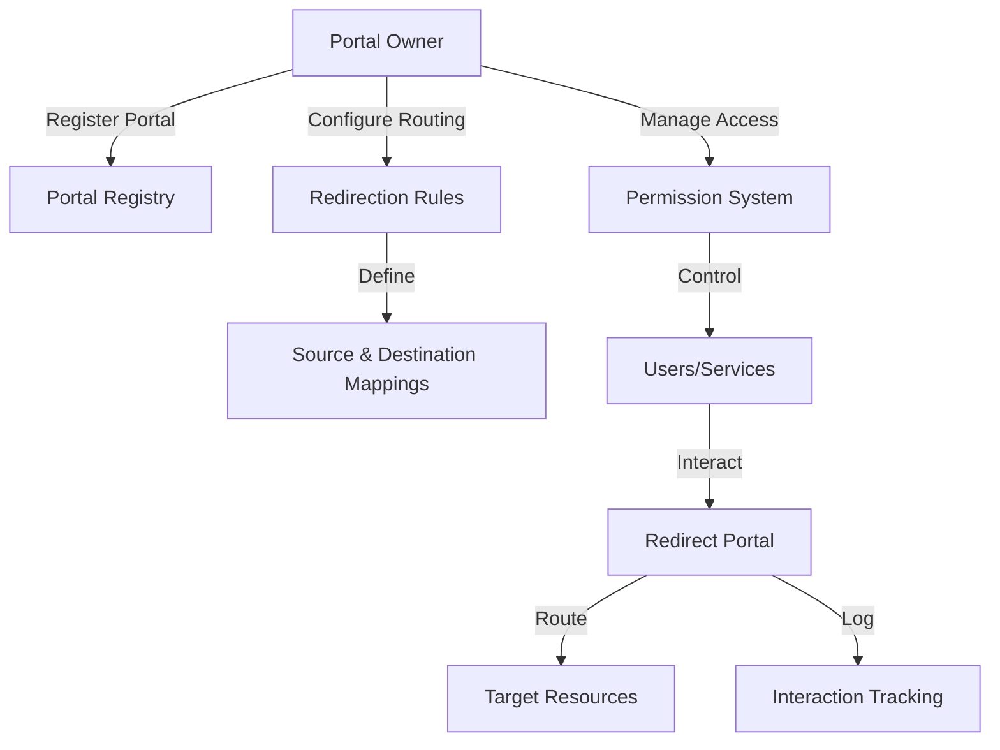

# Redirect Portal

A decentralized portal management and redirection system built on the Stacks blockchain, enabling secure, transparent, and flexible routing of blockchain resources and interactions.

## Overview

Redirect Portal provides a flexible, secure, and transparent mechanism for managing blockchain resource routing and interaction. The system enables:

- Dynamic portal registration
- Flexible resource redirection
- Secure access management
- Comprehensive interaction tracking
- Configurable routing rules

## Architecture

The system is built around a single smart contract that manages portal registrations, redirection rules, access permissions, and interaction logs.



### Core Components

1. **Portal Registry**: Manages portal ownership and configuration
2. **Routing System**: Defines dynamic redirection rules
3. **Permission Management**: Controls access and interaction rights
4. **Audit Logging**: Tracks all portal interactions

## Contract Documentation

### Permission Levels

- `PERMISSION-NONE (u0)`: No access
- `PERMISSION-VIEW (u1)`: View-only access
- `PERMISSION-EDIT (u2)`: Can edit documents
- `PERMISSION-ADMIN (u3)`: Can manage permissions
- `PERMISSION-OWNER (u4)`: Full control

### Action Types

- `ACTION-CREATE (u1)`: Document creation
- `ACTION-VIEW (u2)`: Document access
- `ACTION-EDIT (u3)`: Document modification
- `ACTION-SHARE (u4)`: Permission changes
- `ACTION-DELETE (u5)`: Document deletion

## Getting Started

### Prerequisites

- Clarinet
- Stacks wallet
- Node.js environment

### Basic Usage

1. Register a portal:
```clarity
(contract-call? .portal-registry register-portal "portal123" "Web3 Gateway")
```

2. Create a redirection rule:
```clarity
(contract-call? .portal-registry create-route 
    "portal123" 
    "route-001" 
    'ST1PQHQKV0RJXZFY1DGX8MNSNYVE3VGZJSRTPGZGM 
    'ST2CY5V39MWMZD7B9ZK9HW8CNQQ4XDQRX3XBQF6A
    "Stacks Transfer Portal")
```

3. Grant route management permissions:
```clarity
(contract-call? .portal-registry grant-route-permission 
    "portal123" 
    "route-001" 
    'ST1PQHQKV0RJXZFY1DGX8MNSNYVE3VGZJSRTPGZGM 
    u2)
```

## Function Reference

### Business Management

```clarity
(register-business (business-id (string-ascii 64)) (name (string-ascii 256)))
```
Registers a new business on the platform.

### Document Management

```clarity
(add-document 
    (business-id (string-ascii 64))
    (document-id (string-ascii 64))
    (name (string-ascii 256))
    (description (string-utf8 500))
    (document-hash (buff 32))
    (document-type (string-ascii 64)))
```
Adds a new document to the system.

```clarity
(update-document 
    (business-id (string-ascii 64))
    (document-id (string-ascii 64))
    (name (string-ascii 256))
    (description (string-utf8 500))
    (document-hash (buff 32))
    (document-type (string-ascii 64)))
```
Updates an existing document.

### Access Control

```clarity
(grant-document-permission 
    (business-id (string-ascii 64))
    (document-id (string-ascii 64))
    (user principal)
    (permission-level uint))
```
Grants access permissions to a user.

```clarity
(revoke-document-permission 
    (business-id (string-ascii 64))
    (document-id (string-ascii 64))
    (user principal))
```
Revokes access permissions from a user.

## Development

### Testing

1. Clone the repository
2. Install dependencies
3. Run tests:
```bash
clarinet test
```

### Local Development

1. Start Clarinet console:
```bash
clarinet console
```

2. Deploy contract:
```bash
clarinet deploy
```

## Security Considerations

### Access Control
- Only business owners can register new documents
- Permission levels are strictly enforced
- All access attempts are logged
- Document owners have full control

### Data Privacy
- Only document references are stored on-chain
- Actual documents should be stored off-chain in encrypted form
- Access control is managed through permission levels
- Audit trail maintains accountability

### Limitations
- Document hashes must be managed securely off-chain
- Permission changes require admin access
- No document content encryption on-chain
- Limited to 64-character business and document IDs